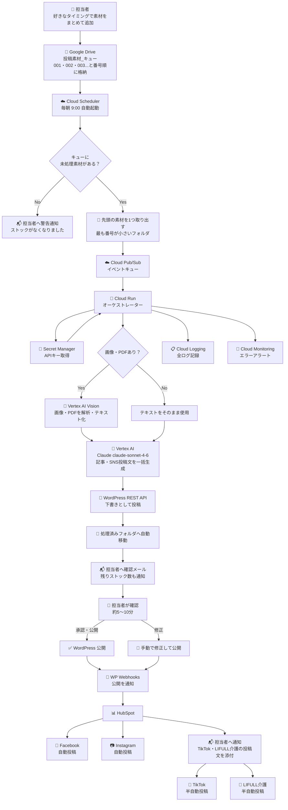
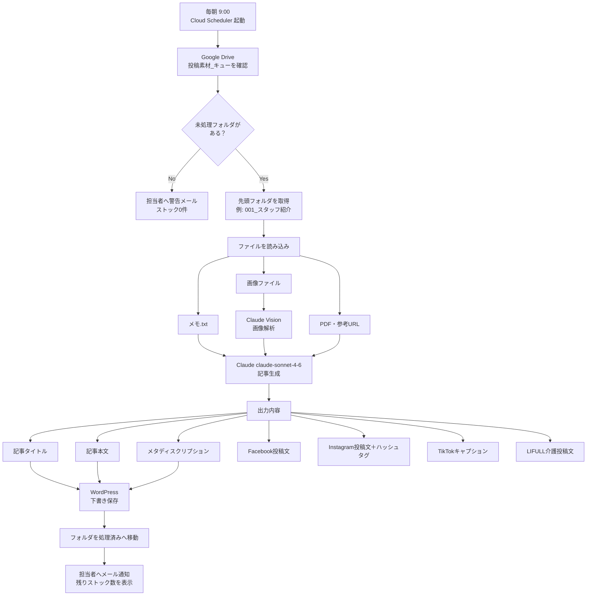
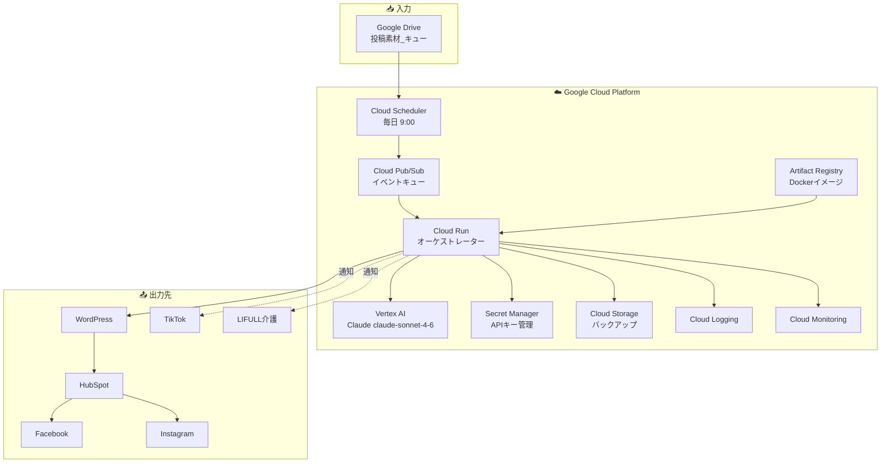
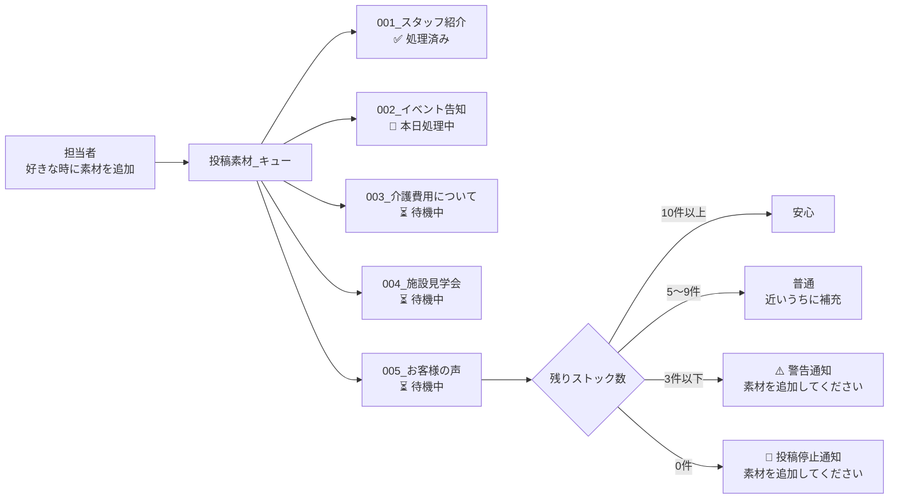
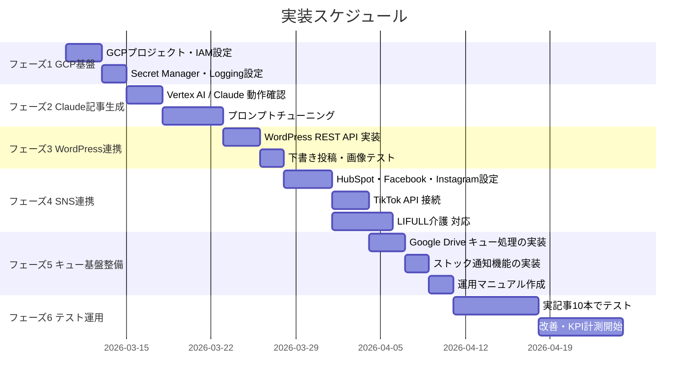

# SNS自動投稿 システム構成図（Mermaid）

作成日: 2026-03-07

---

## 1. 全体フロー

```mermaid
flowchart TD
    A[👤 担当者\n好きなタイミングで素材をまとめて追加] --> B[📁 Google Drive\n投稿素材_キュー\n001・002・003...と番号順に格納]

    B --> C[☁️ Cloud Scheduler\n毎朝 9:00 自動起動]
    C --> D{キューに\n未処理素材がある？}

    D -->|No| E[📬 担当者へ警告通知\nストックがなくなりました]
    D -->|Yes| F[📂 先頭の素材を1つ取り出す\n最も番号が小さいフォルダ]

    F --> G[☁️ Cloud Pub/Sub\nイベントキュー]
    G --> H[🚀 Cloud Run\nオーケストレーター]

    H --> I[🔑 Secret Manager\nAPIキー取得]
    I --> H

    H --> J{画像・PDFあり？}
    J -->|Yes| K[🤖 Vertex AI Vision\n画像・PDFを解析・テキスト化]
    J -->|No| L[テキストをそのまま使用]

    K --> M[🤖 Vertex AI\nClaude claude-sonnet-4-6\n記事・SNS投稿文を一括生成]
    L --> M

    M --> N[📝 WordPress REST API\n下書きとして投稿]
    N --> O[📂 処理済みフォルダへ自動移動]
    O --> P[📬 担当者へ確認メール\n残りストック数も通知]

    P --> Q[👤 担当者が確認\n約5〜10分]
    Q -->|承認・公開| R[✅ WordPress 公開]
    Q -->|修正| S[📝 手動で修正して公開]

    R --> T[🔔 WP Webhooks\n公開を通知]
    S --> T

    T --> U[📊 HubSpot]
    U --> V[📘 Facebook\n自動投稿]
    U --> W[📷 Instagram\n自動投稿]
    U --> X[📬 担当者へ通知\nTikTok・LIFULL介護の投稿文を添付]

    X --> Y[🎵 TikTok\n半自動投稿]
    X --> Z[🏥 LIFULL介護\n半自動投稿]

    H --> LOG[📋 Cloud Logging\n全ログ記録]
    H --> MON[🔔 Cloud Monitoring\nエラーアラート]
```

---

## 2. キュー処理の詳細フロー

```mermaid
flowchart TD
    A[毎朝 9:00\nCloud Scheduler 起動] --> B[Google Drive\n投稿素材_キューを確認]

    B --> C{未処理フォルダが\nある？}
    C -->|No| D[担当者へ警告メール\nストック0件]

    C -->|Yes| E[先頭フォルダを取得\n例: 001_スタッフ紹介]

    E --> F[ファイルを読み込み]
    F --> G[メモ.txt]
    F --> H[画像ファイル]
    F --> I[PDF・参考URL]

    G --> J[Claude claude-sonnet-4-6\n記事生成]
    H --> K[Claude Vision\n画像解析] --> J
    I --> J

    J --> L[出力内容]
    L --> L1[記事タイトル]
    L --> L2[記事本文]
    L --> L3[メタディスクリプション]
    L --> L4[Facebook投稿文]
    L --> L5[Instagram投稿文＋ハッシュタグ]
    L --> L6[TikTokキャプション]
    L --> L7[LIFULL介護投稿文]

    L1 & L2 & L3 --> M[WordPress\n下書き保存]
    M --> N[フォルダを処理済みへ移動]
    N --> O[担当者へメール通知\n残りストック数を表示]
```

---

## 3. GCP インフラ構成

```mermaid
graph TB
    subgraph GCP["☁️ Google Cloud Platform"]
        CS[Cloud Scheduler\n毎日 9:00]
        PS[Cloud Pub/Sub\nイベントキュー]
        CR[Cloud Run\nオーケストレーター]
        VA[Vertex AI\nClaude claude-sonnet-4-6]
        SM[Secret Manager\nAPIキー管理]
        GCS[Cloud Storage\nバックアップ]
        CL[Cloud Logging]
        CM[Cloud Monitoring]
        AR[Artifact Registry\nDockerイメージ]
    end

    subgraph INPUT["📥 入力"]
        GD[Google Drive\n投稿素材_キュー]
    end

    subgraph OUTPUT["📤 出力先"]
        WP[WordPress]
        HS[HubSpot]
        FB[Facebook]
        IG[Instagram]
        TK[TikTok]
        LF[LIFULL介護]
    end

    GD --> CS --> PS --> CR
    CR --> VA
    CR --> SM
    CR --> GCS
    CR --> CL
    CR --> CM
    AR --> CR
    CR --> WP --> HS
    HS --> FB
    HS --> IG
    CR -.->|通知| TK
    CR -.->|通知| LF
```

---

## 4. ストック管理フロー

```mermaid
flowchart LR
    A[担当者\n好きな時に素材を追加] --> B[投稿素材_キュー]

    B --> B1[001_スタッフ紹介\n✅ 処理済み]
    B --> B2[002_イベント告知\n🔄 本日処理中]
    B --> B3[003_介護費用について\n⏳ 待機中]
    B --> B4[004_施設見学会\n⏳ 待機中]
    B --> B5[005_お客様の声\n⏳ 待機中]

    B5 --> C{残りストック数}
    C -->|10件以上| D[安心]
    C -->|5〜9件| E[普通\n近いうちに補充]
    C -->|3件以下| F[⚠️ 警告通知\n素材を追加してください]
    C -->|0件| G[🚨 投稿停止通知\n素材を追加してください]
```

---

## 5. 実装フェーズ（ガントチャート）

```mermaid
gantt
    title 実装スケジュール
    dateFormat  YYYY-MM-DD
    section フェーズ1 GCP基盤
        GCPプロジェクト・IAM設定         :p1a, 2026-03-10, 3d
        Secret Manager・Logging設定      :p1b, after p1a, 2d

    section フェーズ2 Claude記事生成
        Vertex AI / Claude 動作確認       :p2a, after p1b, 3d
        プロンプトチューニング            :p2b, after p2a, 5d

    section フェーズ3 WordPress連携
        WordPress REST API 実装           :p3a, after p2b, 3d
        下書き投稿・画像テスト            :p3b, after p3a, 2d

    section フェーズ4 SNS連携
        HubSpot・Facebook・Instagram設定  :p4a, after p3b, 4d
        TikTok API 接続                   :p4b, after p4a, 3d
        LIFULL介護 対応                   :p4c, after p4a, 5d

    section フェーズ5 キュー基盤整備
        Google Drive キュー処理の実装     :p5a, after p4b, 3d
        ストック通知機能の実装            :p5b, after p5a, 2d
        運用マニュアル作成               :p5c, after p5b, 2d

    section フェーズ6 テスト運用
        実記事10本でテスト               :p6a, after p5c, 7d
        改善・KPI計測開始                :p6b, after p6a, 7d
```
