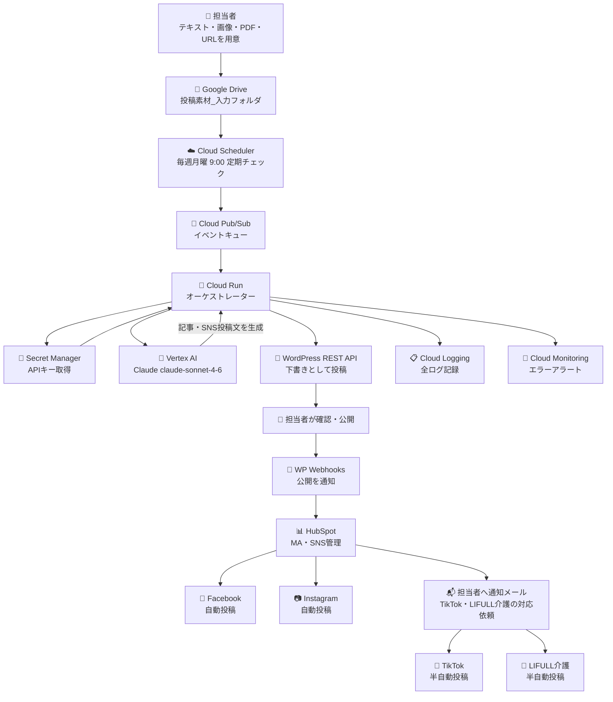
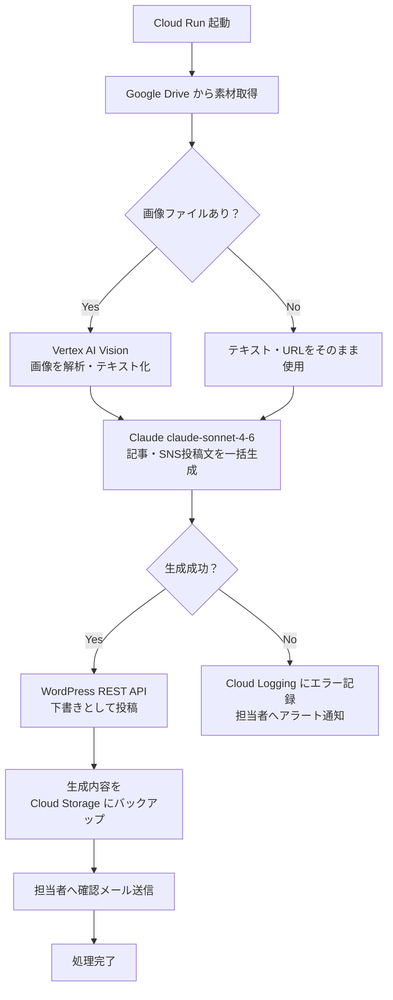
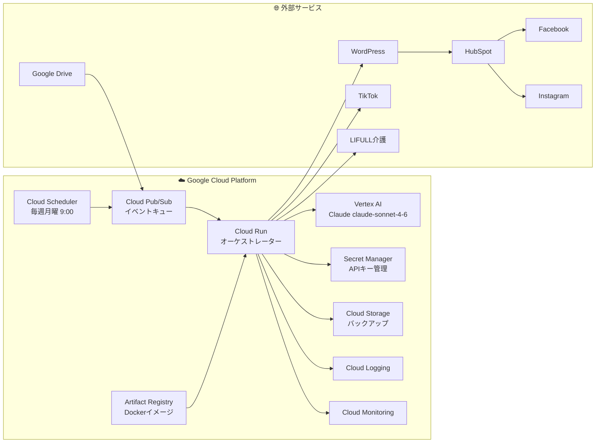
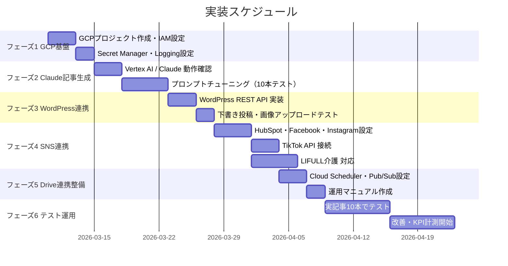
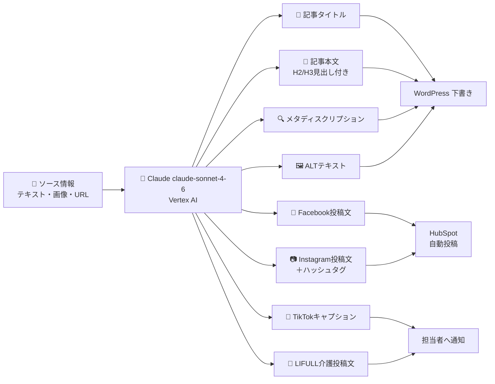

# システム図 v1 — 初版（キュー方式・週1回）

> 作成日: 2026-03-07  
> コミット: 03993c8

---

## 1. 全体フロー

```mermaid
flowchart TD
    A[👤 担当者\nテキスト・画像・PDF・URLを用意] --> B[📁 Google Drive\n投稿素材_入力フォルダ]

    B --> C[☁️ Cloud Scheduler\n毎週月曜 9:00 定期チェック]
    C --> D[📨 Cloud Pub/Sub\nイベントキュー]
    D --> E[🚀 Cloud Run\nオーケストレーター]

    E --> F[🔑 Secret Manager\nAPIキー取得]
    F --> E

    E --> G[🤖 Vertex AI\nClaude claude-sonnet-4-6]
    G --> |記事・SNS投稿文を生成| E

    E --> H[📝 WordPress REST API\n下書きとして投稿]
    H --> I[👤 担当者が確認・公開]

    I --> J[🔔 WP Webhooks\n公開を通知]
    J --> K[📊 HubSpot\nMA・SNS管理]

    K --> L[📘 Facebook\n自動投稿]
    K --> M[📷 Instagram\n自動投稿]
    K --> N[📬 担当者へ通知メール\nTikTok・LIFULL介護の対応依頼]

    N --> O[🎵 TikTok\n半自動投稿]
    N --> P[🏥 LIFULL介護\n半自動投稿]

    E --> Q[📋 Cloud Logging\n全ログ記録]
    E --> R[🔔 Cloud Monitoring\nエラーアラート]
```

---

## 2. Cloud Run 内部処理フロー

```mermaid
flowchart TD
    A[Cloud Run 起動] --> B[Google Drive から素材取得]
    B --> C{画像ファイルあり？}

    C --> |Yes| D[Vertex AI Vision\n画像を解析・テキスト化]
    C --> |No| E[テキスト・URLをそのまま使用]

    D --> F[Claude claude-sonnet-4-6\n記事・SNS投稿文を一括生成]
    E --> F

    F --> G{生成成功？}

    G --> |Yes| H[WordPress REST API\n下書きとして投稿]
    G --> |No| I[Cloud Logging にエラー記録\n担当者へアラート通知]

    H --> J[生成内容を\nCloud Storage にバックアップ]
    J --> K[担当者へ確認メール送信]
    K --> L[処理完了]
```

---

## 3. GCP インフラ構成

```mermaid
graph LR
    subgraph GCP["☁️ Google Cloud Platform"]
        CR[Cloud Run\nオーケストレーター]
        VA[Vertex AI\nClaude claude-sonnet-4-6]
        PS[Cloud Pub/Sub\nイベントキュー]
        CS[Cloud Scheduler\n毎週月曜 9:00]
        SM[Secret Manager\nAPIキー管理]
        GCS[Cloud Storage\nバックアップ]
        CL[Cloud Logging]
        CM[Cloud Monitoring]
        AR[Artifact Registry\nDockerイメージ]
    end

    subgraph EXT["🌐 外部サービス"]
        GD[Google Drive]
        WP[WordPress]
        HS[HubSpot]
        FB[Facebook]
        IG[Instagram]
        TK[TikTok]
        LF[LIFULL介護]
    end

    CS --> PS
    GD --> PS
    PS --> CR
    CR --> VA
    CR --> SM
    CR --> GCS
    CR --> CL
    CR --> CM
    CR --> WP
    WP --> HS
    HS --> FB
    HS --> IG
    CR --> TK
    CR --> LF
    AR --> CR
```

---

## 4. 実装フェーズ

```mermaid
gantt
    title 実装スケジュール
    dateFormat  YYYY-MM-DD
    section フェーズ1 GCP基盤
        GCPプロジェクト作成・IAM設定        :p1a, 2026-03-10, 3d
        Secret Manager・Logging設定         :p1b, after p1a, 2d

    section フェーズ2 Claude記事生成
        Vertex AI / Claude 動作確認          :p2a, after p1b, 3d
        プロンプトチューニング（10本テスト）  :p2b, after p2a, 5d

    section フェーズ3 WordPress連携
        WordPress REST API 実装              :p3a, after p2b, 3d
        下書き投稿・画像アップロードテスト    :p3b, after p3a, 2d

    section フェーズ4 SNS連携
        HubSpot・Facebook・Instagram設定     :p4a, after p3b, 4d
        TikTok API 接続                      :p4b, after p4a, 3d
        LIFULL介護 対応                      :p4c, after p4a, 5d

    section フェーズ5 Drive連携整備
        Cloud Scheduler・Pub/Sub設定         :p5a, after p4b, 3d
        運用マニュアル作成                   :p5b, after p5a, 2d

    section フェーズ6 テスト運用
        実記事10本でテスト                   :p6a, after p5b, 7d
        改善・KPI計測開始                    :p6b, after p6a, 7d
```

---

## 5. Claude による生成コンテンツの流れ

```mermaid
flowchart LR
    A[📄 ソース情報\nテキスト・画像・URL] --> B[🤖 Claude claude-sonnet-4-6\nVertex AI]

    B --> C[📰 記事タイトル]
    B --> D[📝 記事本文\nH2/H3見出し付き]
    B --> E[🔍 メタディスクリプション]
    B --> F[🖼️ ALTテキスト]
    B --> G[📘 Facebook投稿文]
    B --> H[📷 Instagram投稿文\n＋ハッシュタグ]
    B --> I[🎵 TikTokキャプション]
    B --> J[🏥 LIFULL介護投稿文]

    C --> K[WordPress 下書き]
    D --> K
    E --> K
    F --> K

    G --> L[HubSpot\n自動投稿]
    H --> L

    I --> M[担当者へ通知]
    J --> M
```
