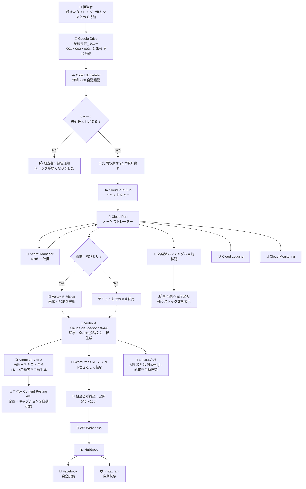
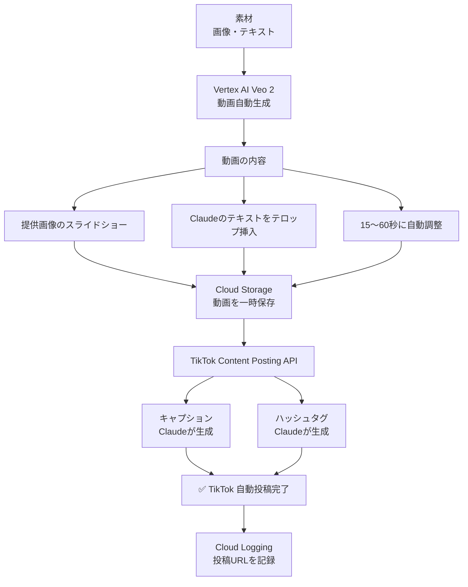
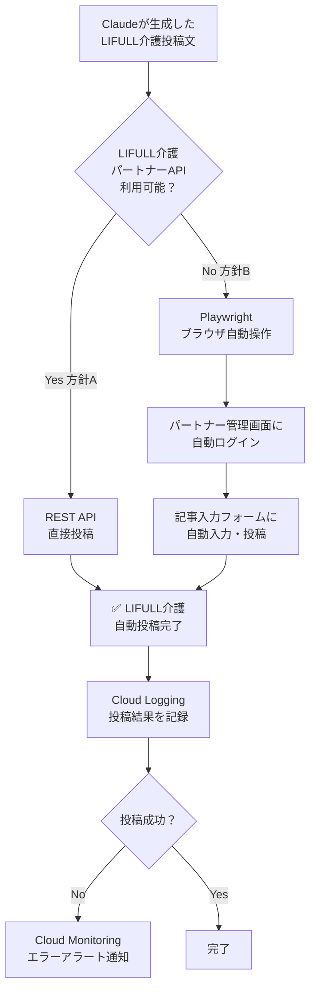
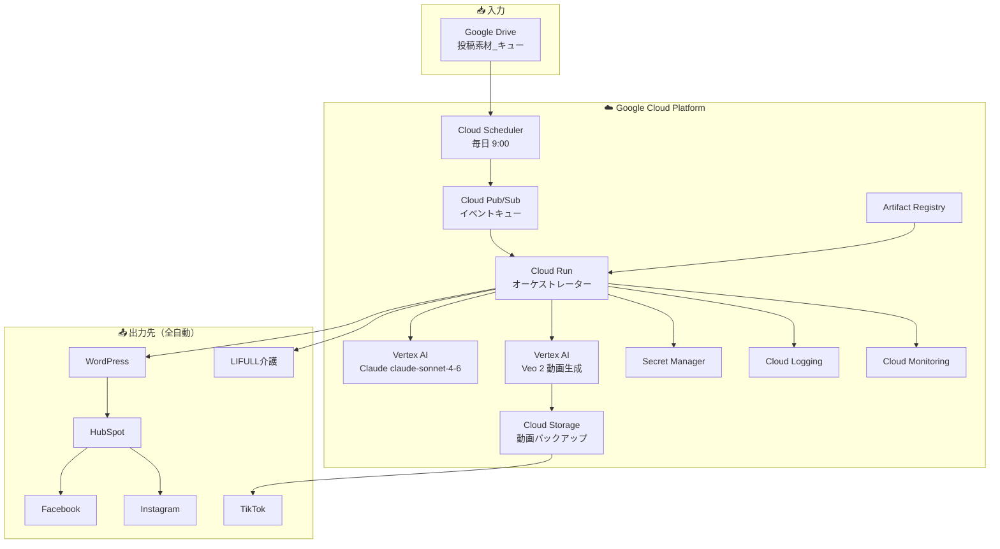
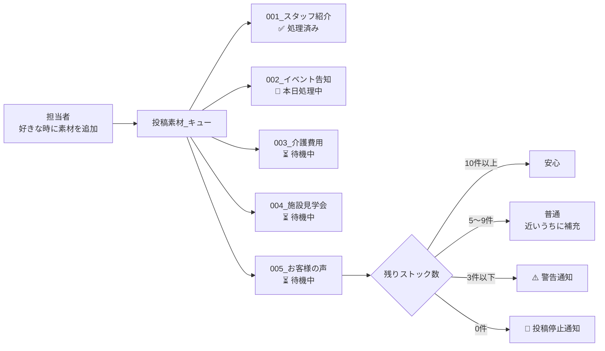
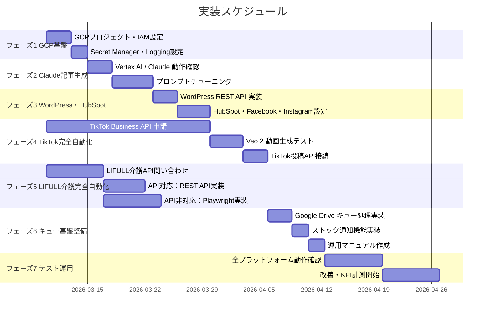

# システム図 v3 — TikTok・LIFULL介護を完全自動化

> 作成日: 2026-03-07  
> コミット: 24fb0b7

---

作成日: 2026-03-07

---

## 1. 全体フロー

---

## 2. TikTok 完全自動化フロー

---

## 3. LIFULL介護 完全自動化フロー

---

## 4. GCP インフラ構成

---

## 5. キュー管理フロー

---

## 6. 実装フェーズ（ガントチャート）

