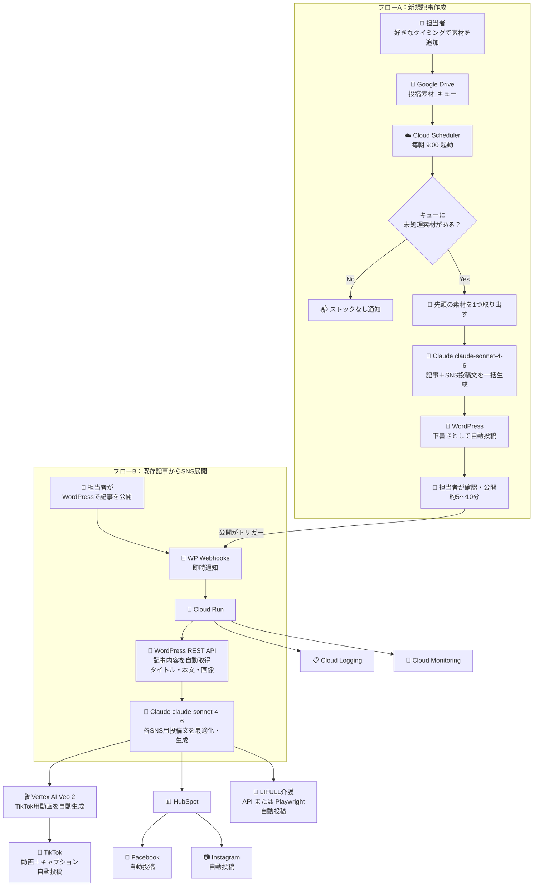
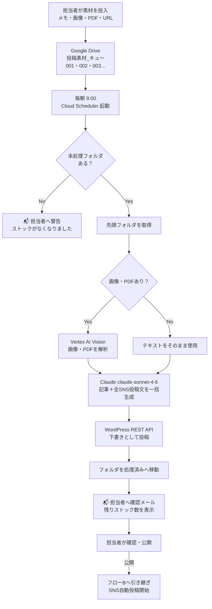
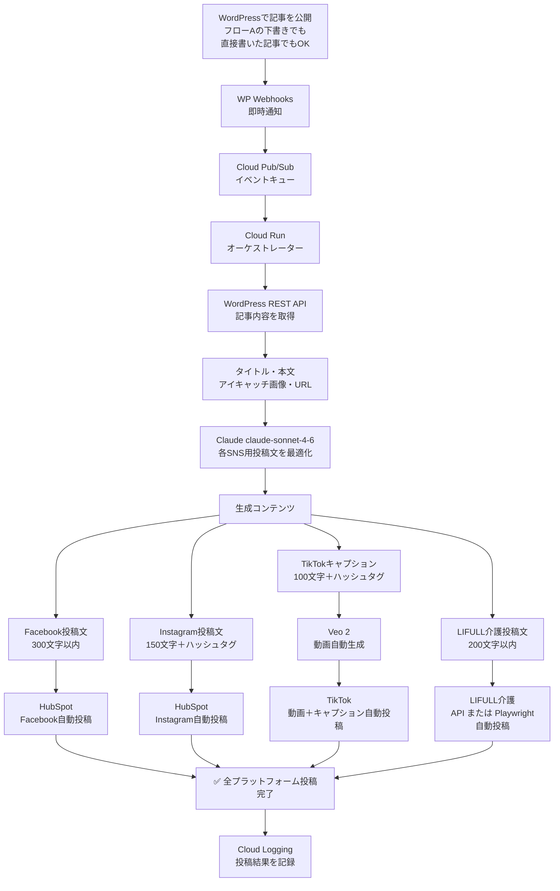
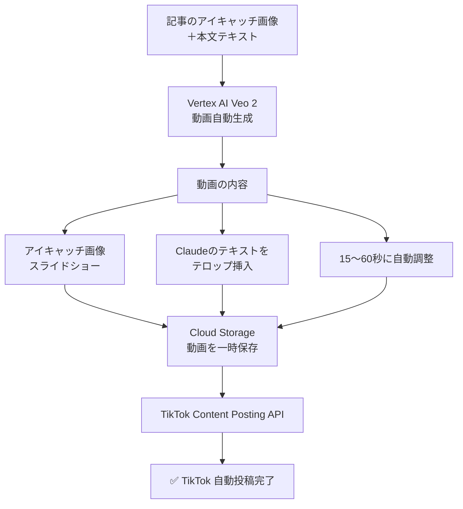
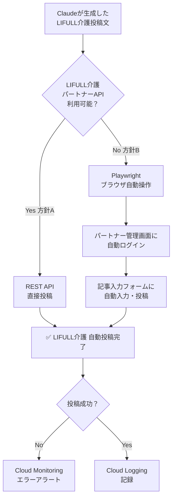
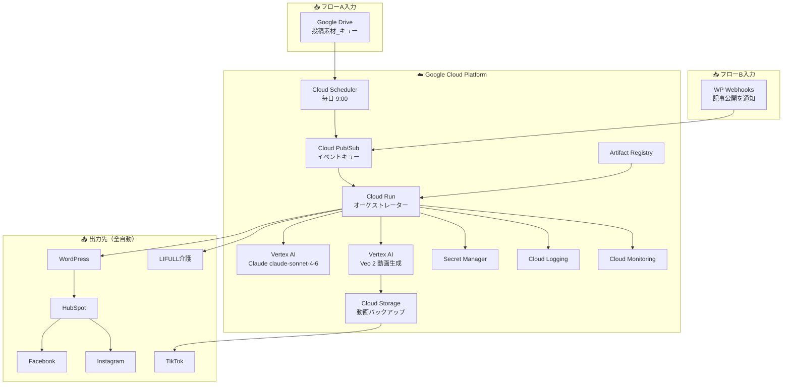
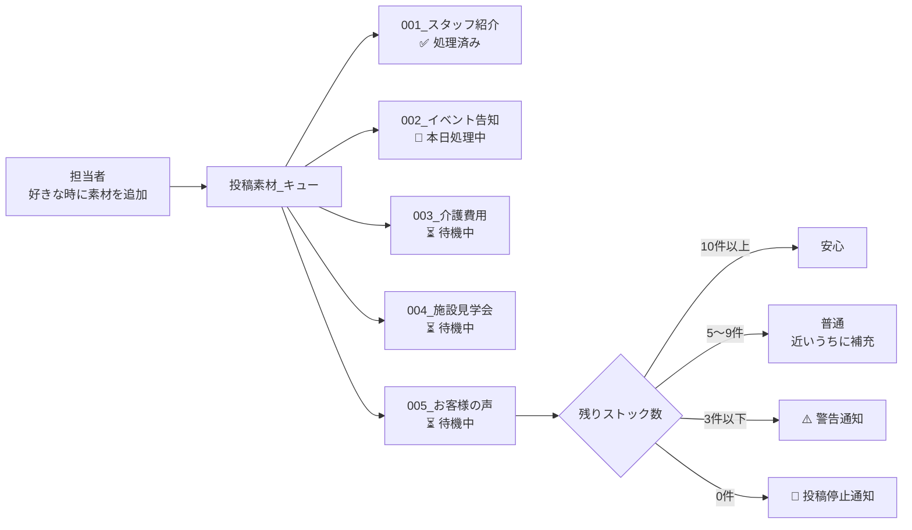
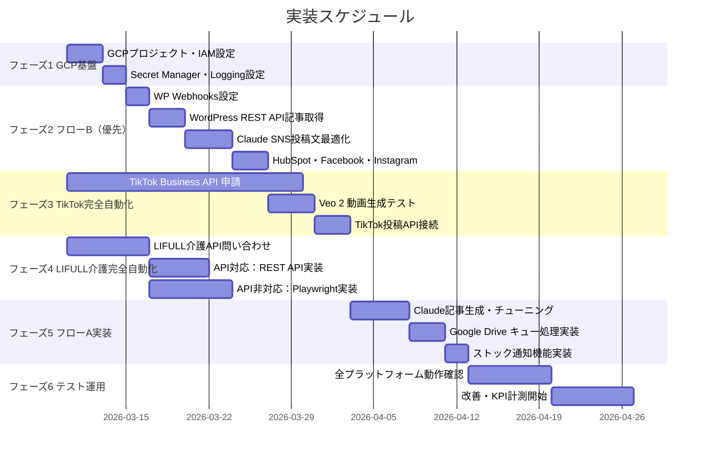

# システム図 v4 — フローB（既存記事SNS展開）追加

> 作成日: 2026-03-07  
> コミット: 7b617fc

---

作成日: 2026-03-07

---

## 1. 全体フロー（フローA・B統合）

---

## 2. フローA 詳細（新規記事作成）

---

## 3. フローB 詳細（既存記事からSNS展開）

---

## 4. TikTok 完全自動化フロー

---

## 5. LIFULL介護 完全自動化フロー

---

## 6. GCP インフラ構成

---

## 7. キュー管理フロー（フローA）

---

## 8. 実装フェーズ（ガントチャート）

