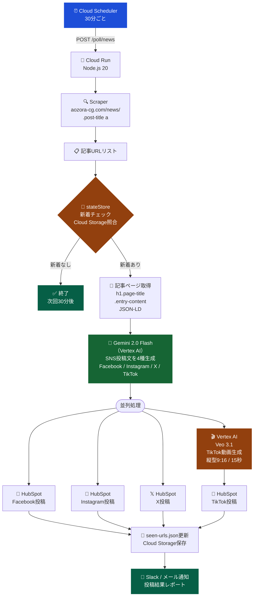
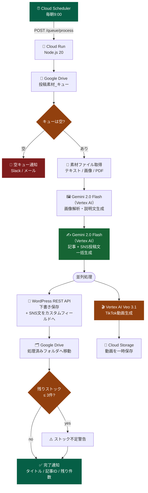
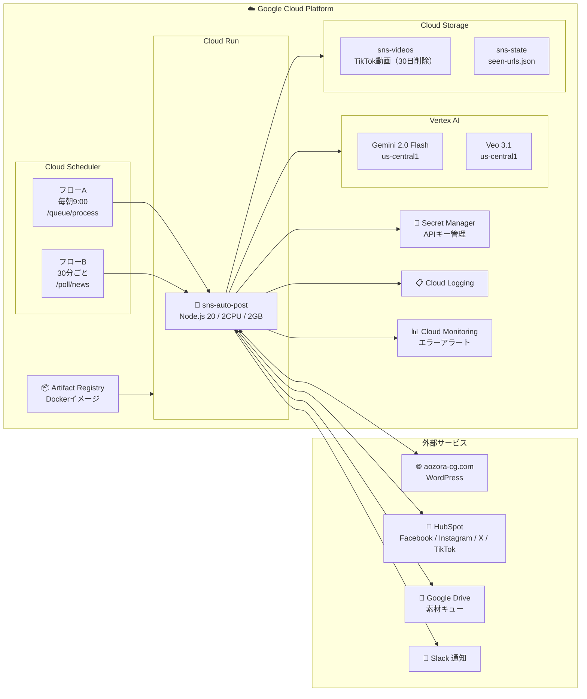

# v7: Gemini 2.0 Flash 切り替え

更新日: 2026-03-19

変更内容: SNS投稿文・記事生成AIをClaude Sonnet 4.6からGemini 2.0 Flash（Vertex AI）に変更

---

## フローB：お知らせ → SNS自動投稿

---

## フローA：素材 → WordPress 下書き作成

---

## GCP インフラ構成

