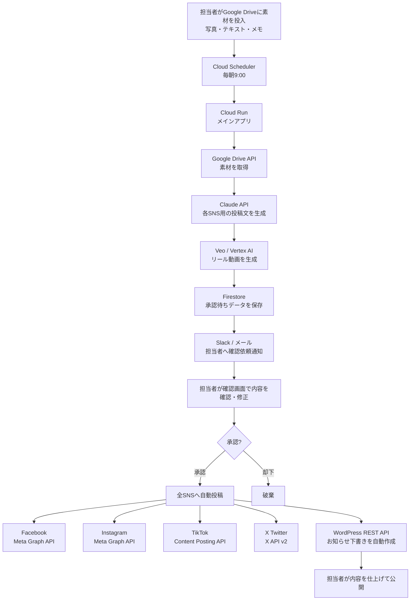
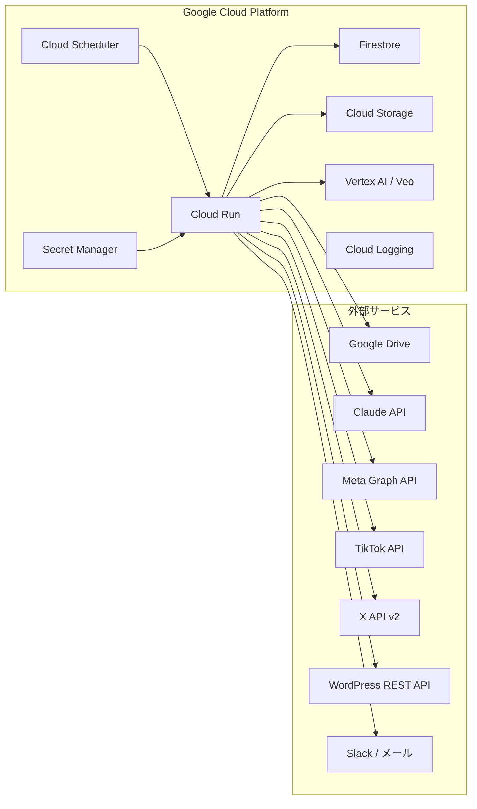

# v8 - 2026-03-31 - 計画 v4.0 全面刷新

## 変更内容
- フローをシンプルな一本道に整理
- フローA/Bの分岐を廃止
- AIをClaude（テキスト）＋Veo（動画）に統一
- 承認UIをWeb確認画面に統一
- WordPressはSNS投稿後にお知らせ下書きを自動作成

## 全体フロー

```mermaid
flowchart TD
    A[担当者がGoogle Driveに素材を投入\n写真・テキスト・メモ] --> B[Cloud Scheduler\n毎朝9:00]
    B --> C[Cloud Run\nメインアプリ]
    C --> D[Google Drive API\n素材を取得]
    D --> E[Claude API\n各SNS用の投稿文を生成]
    E --> F[Veo / Vertex AI\nリール動画を生成]
    F --> G[Firestore\n承認待ちデータを保存]
    G --> H[Slack / メール\n担当者へ確認依頼通知]
    H --> I[担当者が確認画面で内容を確認・修正]
    I --> J{承認?}
    J -- 承認 --> K[全SNSへ自動投稿]
    J -- 却下 --> L[破棄]
    K --> M[Facebook\nMeta Graph API]
    K --> N[Instagram\nMeta Graph API]
    K --> O[TikTok\nContent Posting API]
    K --> P[X Twitter\nX API v2]
    K --> Q[WordPress REST API\nお知らせ下書きを自動作成]
    Q --> R[担当者が内容を仕上げて公開]
```

## システム構成

```mermaid
graph LR
    subgraph GCP["Google Cloud Platform"]
        CS[Cloud Scheduler]
        CR[Cloud Run]
        FS[Firestore]
        GCS[Cloud Storage]
        SM[Secret Manager]
        VA[Vertex AI / Veo]
        CL[Cloud Logging]
    end

    subgraph External["外部サービス"]
        GD[Google Drive]
        CA[Claude API]
        META[Meta Graph API]
        TT[TikTok API]
        X[X API v2]
        WP[WordPress REST API]
        SL[Slack / メール]
    end

    CS --> CR
    CR --> GD
    CR --> CA
    CR --> VA
    CR --> FS
    CR --> GCS
    CR --> META
    CR --> TT
    CR --> X
    CR --> WP
    CR --> SL
    SM --> CR
```
