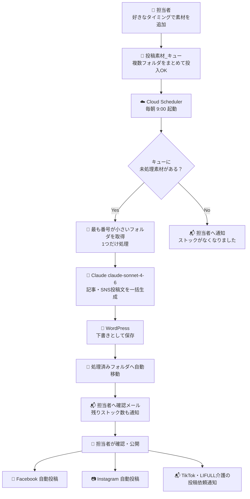

# コンテンツ素材 準備フロー

作成日: 2026-03-07

---

## 1. 基本的な考え方（キュー方式）

素材をまとめて入れておくと、**1日1つずつ自動で順番に処理・投稿**される。
テーマや曜日の縛りはなし。思いついたときにまとめて入れておくだけでよい。

```
担当者が好きなタイミングで素材をまとめて投入
（5つ入れたら5日分のストックになる）

        ↓

毎朝 9:00 に Cloud Scheduler が起動

        ↓

キューの先頭（最も古い素材）を1つ取り出して処理

        ↓

Claude が記事・SNS投稿文を自動生成

        ↓

WordPress に下書き保存 → 担当者が確認・公開

        ↓

Facebook・Instagram に自動投稿
```

---

## 2. Google Drive フォルダ構成

```
広報施策/
└── 📁 投稿素材_キュー/              ← ここに素材をどんどん追加
    ├── 📁 001_スタッフ田中さん紹介/  ← 番号順に処理される
    │   ├── メモ.txt
    │   └── 写真.jpg
    ├── 📁 002_夏のイベント告知/
    │   ├── メモ.txt
    │   └── チラシ.pdf
    ├── 📁 003_介護費用について/
    │   └── メモ.txt
    ├── 📁 004_施設見学会のお知らせ/
    │   ├── メモ.txt
    │   └── 写真1.jpg
    └── 📁 005_お客様の声/
        └── メモ.txt

📁 処理済み/                         ← 投稿完了後に自動で移動
    └── 📁 001_スタッフ田中さん紹介/
```

**フォルダ名のルール：**
`連番_内容メモ`（例：`003_介護費用について`）

連番は3桁推奨（001, 002...）。順番通りに処理される。

---

## 3. キューの仕組み



---

## 4. 担当者への通知メール（イメージ）

```
件名：【広報】下書きが作成されました（残りストック: 4件）

本日の下書きを作成しました。確認・公開をお願いします。

■ 記事タイトル：田中さん（介護士5年目）のご紹介
■ 確認URL：https://your-site.com/wp-admin/post.php?post=123

■ 残りストック: 4件
  次回投稿予定: 002_夏のイベント告知

ストックが3件以下になったら素材の追加をお願いします。
```

ストック残数をメールで毎日通知するため、**補充のタイミングが一目でわかる**。

---

## 5. 最低限必要な素材（1投稿あたり）

**全部なくてもOK。テキストのみでも投稿できる。**

| 素材 | 必須 | あると質が上がる |
|------|------|----------------|
| 伝えたいこと（テキスト・箇条書きでOK） | ✅ | |
| 写真・画像 | | ✅ |
| PDF・参考資料 | | ✅ |
| 参考URL | | ✅ |
| SEOキーワード | | ✅ |

---

## 6. 素材テンプレート（メモ.txt）

```
【テーマ】
（例：スタッフ紹介 / 介護知識 / イベントお知らせ）

【伝えたい内容】
（箇条書きでOK）
・
・
・

【ターゲット】
（例：介護施設を探している家族 / 介護職を目指す方）

【SEOキーワード】
（例：介護 大阪 費用、老人ホーム 選び方）

【参考URL】
（あれば記載）

【Claudeへの指示】
（例：「明るいトーンで」「専門用語は使わないで」）
```

---

## 7. 担当者の作業イメージ

```
【ストックが少なくなったとき（好きなタイミングで）】
素材フォルダをまとめて作成・Google Driveに追加
→ 5〜10件まとめて入れておくと約1〜2週間分のストックになる

【毎朝 9:30 ごろ】
Claudeが生成した下書きの確認メールが届く（約5〜10分）
→ 問題なければ「公開」ボタンを押すだけ

【公開後】
TikTok・LIFULL介護に生成済みの投稿文をコピペして投稿（約5分）

【1日の合計作業時間：約15分】
```

---

## 8. ストック管理の目安

| ストック数 | 状態 | 対応 |
|-----------|------|------|
| 10件以上 | 安心 | そのまま |
| 5〜9件 | 普通 | 近いうちに補充 |
| 3件以下 | 警告 | 素材を追加してください（自動通知あり） |
| 0件 | 投稿停止 | 素材を追加してください（自動通知あり） |
