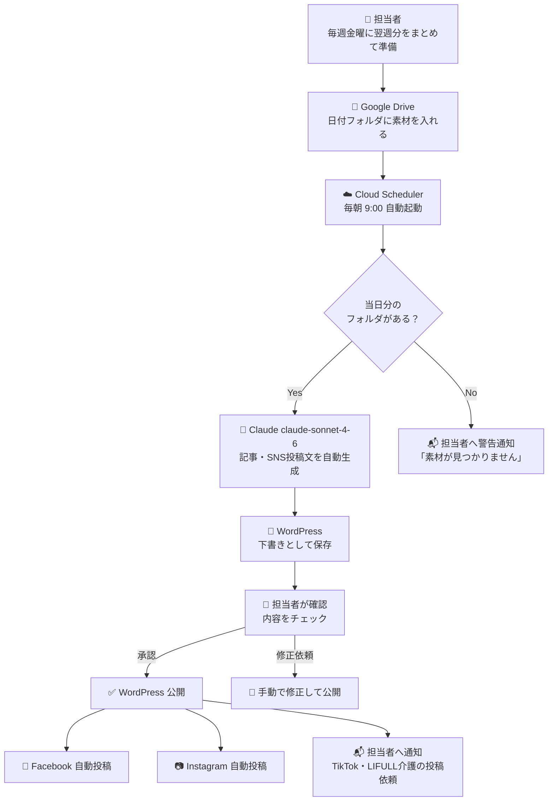

# コンテンツ素材 準備フロー

作成日: 2026-03-07

---

## 1. 曜日別コンテンツテーマ

毎日投稿を継続するために、曜日ごとにテーマを固定する。
担当者は「その日のテーマに合った素材」を用意するだけでよい。

| 曜日 | テーマ | 投稿例 | 素材の難易度 |
|------|--------|--------|------------|
| 月曜 | スタッフ紹介 | 「今週のスタッフ」「入職者インタビュー」 | ★☆☆ |
| 火曜 | 介護知識・豆知識 | 「知っておきたい介護のコツ」 | ★★☆ |
| 水曜 | 施設・サービス紹介 | 「こんなサービスがあります」 | ★☆☆ |
| 木曜 | 事例・お客様の声 | 「ご家族からの声」「利用者さんの笑顔」 | ★★☆ |
| 金曜 | お知らせ・イベント | 「〇〇イベント開催のお知らせ」 | ★☆☆ |
| 土曜 | よくある質問（FAQ） | 「介護費用について」「入居の流れ」 | ★★☆ |
| 日曜 | 週まとめ・コラム | 「今週のハイライト」「季節のコラム」 | ★★★ |

---

## 2. 素材の準備フロー（担当者の作業）

```
毎朝 8:30 までに
Google Drive の「投稿素材_入力」フォルダに
当日分のフォルダを作成して素材を入れる

        ↓

9:00 に Cloud Scheduler が自動検知

        ↓

Claude が自動で記事・SNS投稿文を生成

        ↓

WordPress に下書きとして保存

        ↓

担当者が内容を確認・承認して公開

        ↓

Facebook・Instagram に自動投稿
TikTok・LIFULL介護 は担当者が投稿
```

---

## 3. 最低限必要な素材（1投稿あたり）

Claudeが記事を生成するために最低限必要な情報。
**全部なくてもOK。あるものだけ入れれば生成できる。**

| 素材 | 必須 | あると質が上がる |
|------|------|----------------|
| 伝えたいこと（テキスト・箇条書きでOK） | ✅ | |
| 写真・画像（1枚以上） | | ✅ |
| 参考URL | | ✅ |
| キーワード（SEO） | | ✅ |
| ターゲット読者のメモ | | ✅ |

**最小の素材例（テキストのみでもOK）：**
```
メモ.txt の内容例：
---
テーマ：スタッフ紹介
名前：田中さん（介護士・5年目）
特技：利用者さんとの会話が得意
一言：「毎日笑顔で接することを心がけています」
---
```

---

## 4. Google Drive フォルダ運用ルール

```
広報施策/
└── 📁 投稿素材_入力/
    ├── 📁 2026-03-08_月_スタッフ紹介/   ← 毎朝8:30までに作成
    │   ├── メモ.txt
    │   └── 写真.jpg
    │
    ├── 📁 2026-03-09_火_介護知識/
    │   └── メモ.txt
    │
    └── 📁 2026-03-10_水_施設紹介/
        ├── メモ.txt
        ├── 写真1.jpg
        └── 参考URL.txt
```

**フォルダ名のルール：**
`YYYY-MM-DD_曜日_テーマ`

例：`2026-03-10_水_施設紹介`

---

## 5. 1週間分まとめて準備する方法（推奨）

毎日準備するのが大変な場合は、**週に1回まとめて翌週分を準備**する方法が効率的。

```
毎週金曜日に翌週7日分の素材フォルダをまとめて作成
        ↓
Cloud Scheduler が毎朝9:00に当日分のフォルダを自動検知
        ↓
毎日自動で記事生成・投稿
```

**週1回の準備作業（目安：1〜2時間）**

| 作業 | 時間目安 |
|------|---------|
| テーマ確認・素材収集 | 30分 |
| 7日分のフォルダ作成・メモ記入 | 30分 |
| 写真の選定・アップロード | 30分 |
| **合計** | **約1.5時間/週** |

---

## 6. 素材テンプレート（コピーして使用）

### メモ.txt テンプレート

```
【テーマ】
（例：スタッフ紹介 / 介護知識 / イベントお知らせ）

【伝えたい内容】
（箇条書きでOK）
・
・
・

【ターゲット】
（例：介護施設を探している家族 / 介護職を目指す方）

【SEOキーワード】
（例：介護 大阪 費用、老人ホーム 選び方）

【参考URL】
（あれば記載）

【備考・注意事項】
（Claudeへの指示があれば記載）
（例：「明るいトーンで」「専門用語は使わないで」）
```

---

## 7. コンテンツカレンダー（3月分サンプル）

| 日付 | 曜日 | テーマ | 素材状況 |
|------|------|--------|---------|
| 3/10 | 月 | スタッフ紹介 | 未作成 |
| 3/11 | 火 | 介護知識 | 未作成 |
| 3/12 | 水 | 施設紹介 | 未作成 |
| 3/13 | 木 | お客様の声 | 未作成 |
| 3/14 | 金 | イベントお知らせ | 未作成 |
| 3/15 | 土 | FAQ | 未作成 |
| 3/16 | 日 | 週まとめ | 未作成 |

---

## 8. フロー全体図（Mermaid）



---

## 9. 担当者の1日の作業イメージ

```
【毎週金曜】
翌週7日分の素材をまとめてGoogle Driveに準備（約1.5時間）

【毎朝 9:30 ごろ】
Claudeが生成した下書きの確認メールが届く（約5〜10分）
↓
問題なければ「公開」ボタンを押すだけ

【公開後】
TikTok・LIFULL介護に生成済みの投稿文をコピペして投稿（約5分）

【1日の合計作業時間：約15分】
```
